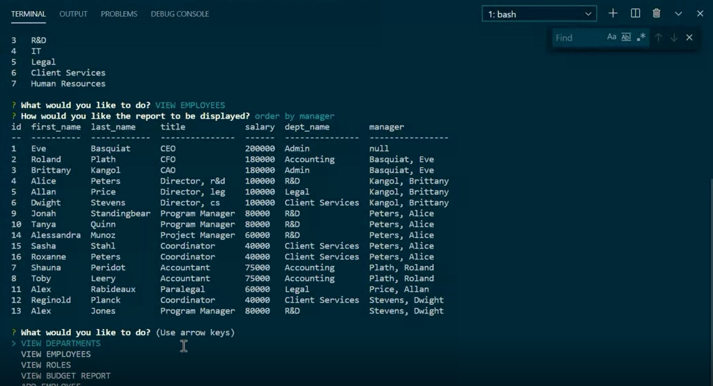

# onBase

## Description
This application is a content management system designed to manage a company's employee database from the command line.

### Languages used:
- MySQL
- Node
- ES6

### NPM Packages:
- Inquirer
- MySQL2
- Console.table
- dotenv

## Table of Contents:
- [Instructions for Installation](#instructions-for-installation)
- [Usage](#usage)
- [Contribution Guidelines](#contribution-guidelines)
- [Questions?](#questions?)

## <a name="instructions-for-installation">Instructions for Installation</a>:
1. clone onBase repository
1. install Node.js 'npm init --y'
1. from the terminal, run 'npm start'

## <a name="usage">Usage</a>:
[*Click the image-link to access a video walkthrough of the application:*](https://drive.google.com/file/d/1CLjxrXYo8OLtx0Et6v7oRI7EM2dxlzKD/view)

    
## <a name="contribution-guidelines">Contribution Guidelines</a>:
Made with ☕+❤️ by Sara Krizan and in consultation with several LAs, TA, and learning instructor through the University of Wisconsin Extended Campus Coding Bootcamp.

Please feel free to contact me via my GitHub account below with any requests to contribute to this project or collaborate on future works.
    

## <a name="questions?">Questions?</a> 
Sara Krizan    
[GitHub](https://github.com/SMKrizan)
    